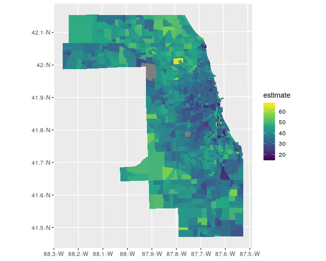
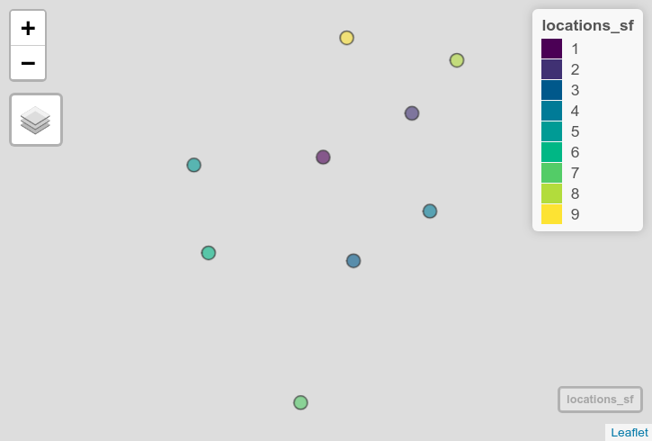
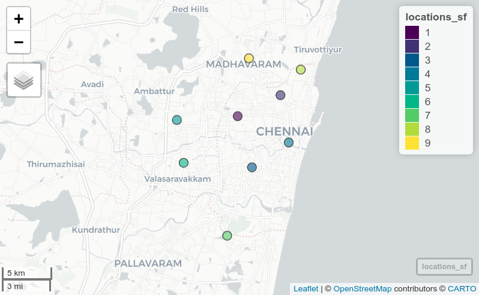

# crsuggest

[](https://CRAN.R-project.org/package=crsuggest) 

__crsuggest__ is a small R package to help spatial analysts determine an appropriate projected coordinate reference system for their data.  It implements functions that attempt to match an input spatial dataset with corresponding coordinate reference systems that will work well for mapping and/or spatial analysis.  The package is inspired by the more cleverly-named [projestions API](https://github.com/ebrelsford/projestions) and [companion QGIS plugin](https://github.com/ebrelsford/qgis-projestions).  It uses data from the EPSG Registry, a product of the International Association of Oil & Gas Producers, and [is subject to its terms of use for the data](https://epsg.org/terms-of-use.html).

Install from CRAN with the following command in R:

```r
install.packages("crsuggest")
```

Or get the development version from GitHub:

```r
remotes::install_github("walkerke/crsuggest")
```

Consider the following common use cases in R:

### Use case 1: Analyzing unprojected data

Let's say you've obtained a points dataset in a geographic coordinate system and you'd like to draw buffers around those points:

```r
library(tigris)
library(sf)

tx_landmarks <- landmarks("TX")

landmark_buf <- st_buffer(tx_landmarks, 1)
```
```
# The message:
dist is assumed to be in decimal degrees (arc_degrees).
Warning message:
In st_buffer.sfc(st_geometry(x), dist, nQuadSegs, endCapStyle = endCapStyle,  :
  st_buffer does not correctly buffer longitude/latitude data
```

`st_buffer()` is telling us that we need a projected coordinate system.  But how do we figure out the right one for our data?  For local areas (e.g. a US state) there are a number of options designed to minimize distortion for that area.  `suggest_crs()` aims to put these options at your fingertips.  

```r
library(crsuggest)

possible_crs <- suggest_crs(tx_landmarks)

dplyr::glimpse(possible_crs)
```
```
Rows: 10
Columns: 6
$ crs_code  <chr> "6580", "6579", "3666", "3665", "3085", "3084", "3083", "3082"…
$ crs_name  <chr> "NAD83(2011) / Texas Centric Lambert Conformal", "NAD83(2011) …
$ crs_type  <chr> "projected", "projected", "projected", "projected", "projected…
$ crs_gcs   <dbl> 6318, 6318, 4759, 4759, 4152, 4152, 4269, 4269, 4269, 4267
$ crs_units <chr> "m", "m", "m", "m", "m", "m", "m", "m", "m", "ft"
$ crs_proj4 <chr> "+proj=lcc +lat_0=18 +lon_0=-100 +lat_1=27.5 +lat_2=35 +x_0=15…
```

By default, `suggest_crs()` returns the top 10 matches for a given input spatial dataset.  From here, you can browse the returned CRS options, select an appropriate entry, and use the EPSG or proj4string codes in your analysis.  For example, we can now choose a coordinate system, transform, and re-run: 

```r
landmarks_projected <- st_transform(tx_landmarks, 3081)

buffer_1km <- st_buffer(landmarks_projected, 1000)
```

### Use case 2: Customizing arguments

Let's say you've obtained a spatial dataset, but you already know you want a projected coordinate system with a specific geographic coordinate system (e.g. NAD 1983, EPSG code 4269) and specific measurement units (US Feet).  `suggest_crs()` has `gcs` and `units` parameters that allow subsetting in this way.

```r
library(tidycensus)
library(ggplot2)
library(sf)

# Median age by Census tract in Cook County, Illinois
cook_age <- get_acs(geography = "tract",
                    variables = "B01002_001",
                    state = "IL",
                    county = "Cook County",
                    geometry = TRUE)
                    
cook_crs <- suggest_crs(cook_age, gcs = 4269, units = "us-ft")

dplyr::glimpse(cook_crs)
```
```
Rows: 2
Columns: 6
$ crs_code  <chr> "3435", "32166"
$ crs_name  <chr> "NAD83 / Illinois East (ftUS)", "NAD83 / BLM 16N (ftUS)"
$ crs_type  <chr> "projected", "projected"
$ crs_gcs   <dbl> 4269, 4269
$ crs_units <chr> "us-ft", "us-ft"
$ crs_proj4 <chr> "+proj=tmerc +lat_0=36.6666666666667 +lon_0=-88.3333333333333 +k=0.99…
```

We get two options to choose from; one in the State Plane system and the other in the BLM system.  

Alternatively, if you just need to quickly get a code for plotting appropriately, you can use the function `suggest_top_crs()`.  This will return either the EPSG code or proj4string of the top CRS entry for your data.  It should be used with caution; I recommend researching the output especially before using it for spatial analysis.  

```r
suggest_top_crs(cook_age)
```
```
> suggest_top_crs(cook_age)
Using the projected CRS NAD83 / Illinois East (ftUS) which uses 'us-ft' for measurement units. Please visit https://spatialreference.org/ref/epsg/3435/ for more information about this CRS.
[1] 3435
```

We can use the State Plane Illinois East CRS in plotting functions like `coord_sf()`:

```r                       
ggplot(cook_age, aes(fill = estimate)) + 
  geom_sf(color = NA) + 
  coord_sf(crs = 3435) + 
  scale_fill_viridis_c()
```



### Use case 3: guessing the CRS of a dataset without projection information

Commonly, analysts will work with data for which the origin is not known.  These datasets may include CSV files that represent locations or shapefiles missing the .prj file for coordinate system information.  If these datasets are represented in projected coordinates, it can be difficult to figure out how to correctly handle the data in a geospatial software environment. 
The `guess_crs()` function, inspired by the [WhatTheProj](https://stevage.github.io/WhatTheProj/) project, aims to help with this.  Consider this example dataset of locations collected in the field.  The coordinates are clearly from a projected CRS, but without knowledge of that CRS they cannot be mapped correctly.  

```r
library(sf)
library(mapview)

locations <- data.frame(
  X = c(1200822.97857801, 1205015.51644983, 1202297.44383987, 1205877.68696743, 
        1194763.21511923, 1195463.42403192, 1199836.01037452, 1207081.96500368, 
        1201924.15986897),
  Y = c(1246476.31475063, 1248612.72571423, 1241479.45996392, 1243898.58428024, 
        1246033.7550009, 1241827.7730307, 1234691.50899912, 1251125.67808482, 
        1252188.4333016),
  id = 1:9
)

locations_sf <- st_as_sf(locations, coords = c("X", "Y"))

mapview(locations_sf)
```



If the general location of the data is known, `guess_crs()` will make guesses on the coordinate system from which the data come.  The EPSG code will be returned along with a `dist_km` column; this is the distance between the center point of the input dataset and your known location _if_ they are in a given CRS.  If the distance is large, the coordinate system likely won't work.  If the [mapboxapi package](https://walker-data.com/mapboxapi/) is installed, you can supply a location name as your target location; otherwise, supply a length-2 coordinate pair vector of form `c(longitude, latitude)`.

```r
library(crsuggest)
guess_crs(locations_sf, "Chennai, India", n_return = 5)
```
```
Evaluating CRS options...
The 'best guess' for the CRS of your data is EPSG code 7785.
Use `sf::st_crs(your_data) <- 7785` to use this CRS for your data.
View the returned dataset for other possible options.
# A tibble: 5 x 2
  crs_code dist_km
  <chr>      <dbl>
1 7785        4.09
2 24344     806.  
3 32644     806.  
4 32244     806.  
5 32444     806.  
```

The clear choice here is EPSG code 7785 for WGS84 / Tamil Nadu; no other possibilities are suitable here (and this is the correct answer!).  Use this code to set the CRS for your data which will allow for correct placement of the points.

```r
st_crs(locations_sf) <- 7785

mapview(locations_sf)
```



### A word of caution: 

__crsuggest__ is designed to make CRS _recommendations_: the right CRS for your project will be based on a variety of factors that can't always safely be automated.  If you intend to use these tools in production data pipelines, use at your own risk and I would strongly recommend checking your data for unexpected results. I personally the packages as a "look-up" tool to help you make informed decisions.  Research the coordinate system you plan to use - and how it handles distortion of your data - before settling on it for use in production.  


